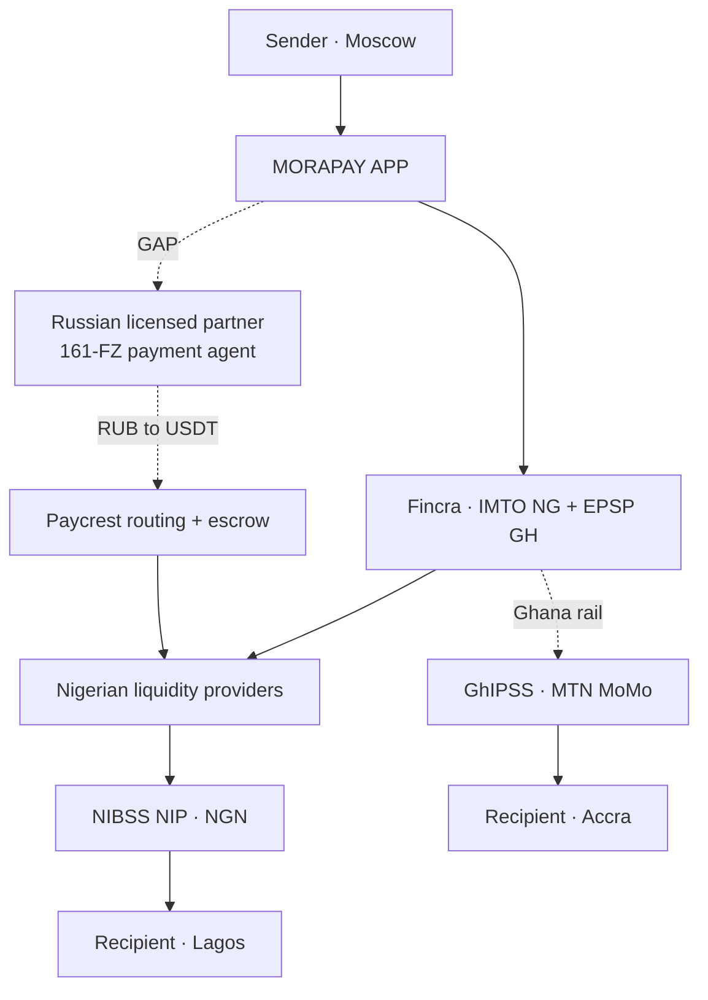
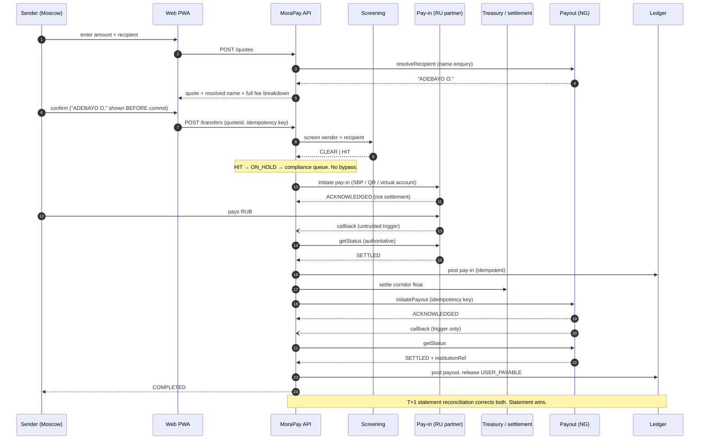
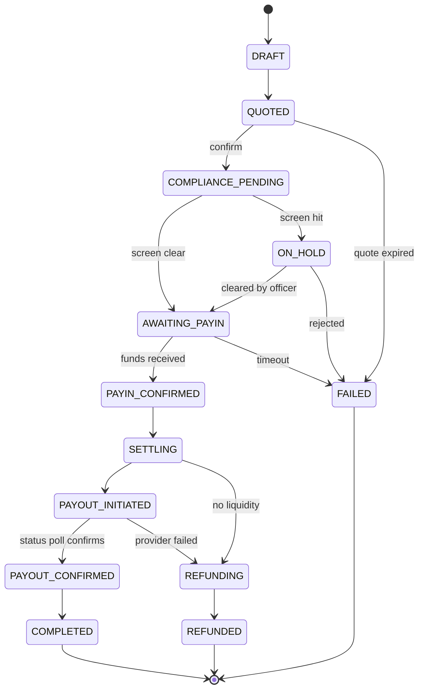
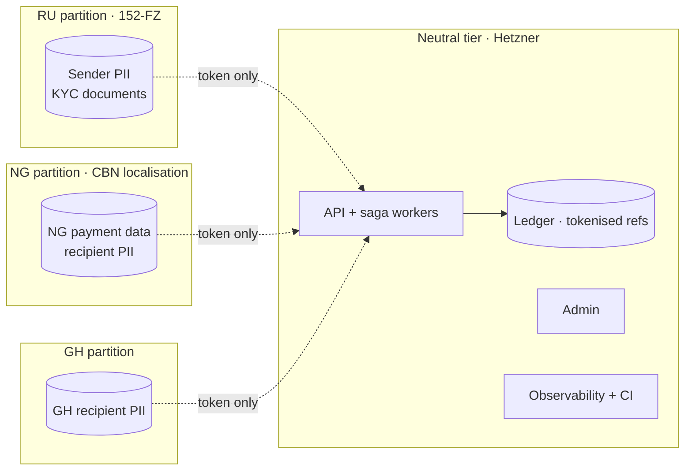
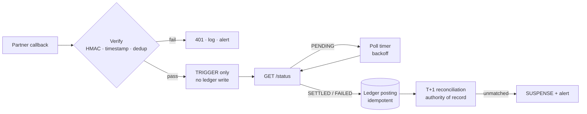

# Technical Architecture

**Cross-border remittance platform · Russia/CIS → Nigeria & Ghana**

|                  |                                                                                 |
| ---------------- | ------------------------------------------------------------------------------- |
| Companion to     | `docs/BUILD_PLAN.md`                                                            |
| Status           | v0.1 — living document                                                          |
| Scope            | Corridor architecture, provider abstraction, callback security, ledger postings |
| Reference inputs | Paycrest partnership deck · FreshPay/PayDRC API v1.1 · PayDRC sequence diagram  |

> CONFIDENTIAL WORKING DOCUMENT · LIVING DRAFT · NOT LEGAL ADVICE

---

## 1. What the reference material tells us

### 1.1 Paycrest — solves the second half of the corridor, presupposes the first

The Paycrest deck is a strong fit for the settlement and payout legs. It is also, read carefully, **addressed to a bank, not to an application**. Every role it assigns is labelled "Your Role (Russian Bank Partner)":

> Provide Virtual Accounts for Russian senders to deposit rubles · Provide Stablecoin Liquidity: Convert RUB → Stablecoins · Provide PSP access and API documentation

We are not that bank. This is the single most important thing the deck tells us: **Paycrest is asking someone to fill exactly the gap identified in Build Plan step 6.3.** Signing with Paycrest does not close it. We either bring a Russian licensed partner who takes that role, or we sit as the application layer on top of a bank that already has it.

| Assessment        | Finding                                                                                                                                                                   |
| ----------------- | ------------------------------------------------------------------------------------------------------------------------------------------------------------------------- |
| Covers            | Settlement routing, non-custodial escrow, Nigerian liquidity aggregation, payout to NGN bank accounts                                                                     |
| Does not cover    | The Russia pay-in leg, RUB collection, sender KYC, our own licensing                                                                                                      |
| Live coverage     | Nigeria (stated largest market), Kenya, Uganda, Tanzania, Argentina. **Ghana is not listed.** "62 countries integrated & activating" is forward-looking, not current      |
| Ghana implication | Ghana requires a separate rail — Fincra's EPSP (May 2026) or equivalent. This is not a weakness; it gives us the partner diversification the build plan requires anyway   |
| Custody           | Non-custodial. Important nuance: this protects _their_ regulatory position, not ours. We still collect from senders and therefore still need authorisation on our own leg |
| Compliance claim  | "Regulatory Compliance: Handled throughout via automated screening." Screening is not licensing. This needs diligence, not acceptance                                     |

Their worked example is internally coherent and consistent with current rates: 100,000 ₽ → 1,298 USDT → ₦1,888,590 implies roughly 77 ₽/USDT and ₦1,455/USDT, the latter matching the NFEM range in our feasibility analysis. Note what the example does **not** show: any explicit fee. The margin lives entirely inside "you set your own rates." That is fine as a wholesale model and directly at odds with the transparent-pricing product we specified. **We must decompose that spread and show it to the sender** even though the rail does not require us to.

### 1.2 FreshPay / PayDRC — the right shape, the wrong details

FreshPay is a DRC processor (CDF, Airtel/Orange/M-Pesa/Afrimoney). It is **not a candidate partner** for our corridor. It is an excellent **pattern reference**, because Nigerian and Ghanaian aggregators expose the same async shape: submit → acknowledge → poll or callback → reconcile.

It is also a catalogue of the mistakes we must not repeat. These are specific and verifiable in the supplied spec:

| #   | Issue in the FreshPay spec                                                                                                                 | Why it matters                                                                                                  | What we do                                                                                                            |
| --- | ------------------------------------------------------------------------------------------------------------------------------------------ | --------------------------------------------------------------------------------------------------------------- | --------------------------------------------------------------------------------------------------------------------- |
| 1   | `Status: "Success"` means "received", while `Trans_Status: "Failed"` is the real outcome — both appear in the same example response (§6.2) | The classic double-credit bug. A naive integration reads `Status` and credits a customer whose payment failed   | Acknowledgement and outcome are **different types** that cannot be substituted (§3.2)                                 |
| 2   | Documented as AES-256-CBC; implemented as AES-128 — the Python/PHP/Node/Java samples all use a 16-byte key                                 | Doc and implementation disagree about the primitive. Whichever you trust, you are wrong somewhere               | Specify the primitive once, in one place, and test it                                                                 |
| 3   | `IV = SECRET_KEY` in all four samples                                                                                                      | A static IV equal to the key defeats CBC. Identical plaintexts produce identical ciphertexts, leaking structure | Random IV per message, prepended to ciphertext. Better: **AES-256-GCM**, which authenticates and encrypts in one pass |
| 4   | Non-constant-time signature comparison in Node (`===`) and Java (`.equals`)                                                                | Timing side-channel on signature verification, in two of four reference implementations                         | Constant-time compare, always, with a test that fails if someone reverts it                                           |
| 5   | No timestamp, nonce or event ID in the signature                                                                                           | No replay protection. The spec offers IP allowlisting instead, which is a different control entirely            | Signed timestamp with ±5 min window, plus event-ID dedup table                                                        |
| 6   | `merchant_secrete` transmitted in the request body on every call                                                                           | Long-lived credential in every payload, every log line, every proxy buffer                                      | Credentials in headers/auth only. Never in a body we might log                                                        |
| 7   | `"Amount": 100.0` — money as a JSON float in responses                                                                                     | Floating-point money. Precision loss is a question of when, not whether                                         | Integer minor units at the boundary; reject or convert on parse, never propagate the float                            |
| 8   | Field naming inconsistency — documented `email`, sent as `"e-mail"`; `secrete` for `secret`                                                | Silent integration failures that surface in production                                                          | Adapter layer normalises; contract tests pin the wire format                                                          |
| 9   | Callback handler does the work synchronously and echoes decrypted data back in the 200 response                                            | Slow ACK invites provider retries and duplicate delivery; echoing decrypted PII is gratuitous                   | Verify, enqueue, return 200 immediately. Body carries no data                                                         |
| 10  | `Financial_Institution_id` appears only in status/callback, not the initial response                                                       | The provider reference needed for reconciliation does not exist at submit time                                  | Our ledger keys on _our_ idempotency key; provider refs attach later                                                  |

### 1.3 The supplied sequence diagram

The PayDRC diagram (Initiator → API → Switch → Gateway → MNOs) is structurally right and compliance-blind. It has no screening gate, no name enquiry, and it treats the callback as the source of truth. Our corrected version is §2.2.

---

## 2. Target architecture

### 2.1 Partner topology



The dashed elements are unclosed gaps, not design choices. Two of them:

1. **The Russian licensed partner.** No pay-in without it. This is the critical path item and it is commercial, not technical — engineering proceeds against the simulator in the meantime (Build Plan 6.1).
2. **Ghana payout.** Not in Paycrest's live coverage. Needs Fincra EPSP or equivalent.

### 2.2 End-to-end sequence · Moscow → Lagos



Three things distinguish this from the PayDRC reference:

- **Name enquiry happens before the sender confirms.** Showing "ADEBAYO O." back to the sender prevents the single most common support case in this corridor — money sent to a mistyped account number, unrecoverable once settled.
- **A compliance gate sits between quote and pay-in**, and no code path bypasses it.
- **Every callback is followed by a status poll.** The callback is a trigger. The poll is believed.

### 2.3 Transfer state machine



`PAYOUT_INITIATED` is deliberately distinct from `PAYOUT_CONFIRMED`. Collapsing them is the FreshPay `Status`/`Trans_Status` bug expressed in state.

### 2.4 Ledger postings

Every posting below is a balanced double-entry transaction. `USER_PAYABLE` is our liability to the sender: it is credited when we receive their money and only released when the payout is confirmed.

| Event                           | Debit                        | Credit                                         |
| ------------------------------- | ---------------------------- | ---------------------------------------------- |
| Pay-in confirmed (RUB received) | `FLOAT_RUB`                  | `USER_PAYABLE` (send amount)                   |
|                                 |                              | `FEE_REVENUE` (fixed fee + FX margin)          |
| Settlement out of RUB float     | `PARTNER_RECEIVABLE`         | `FLOAT_RUB`                                    |
| Settlement into NGN float       | `FLOAT_NGN`                  | `PARTNER_RECEIVABLE`                           |
| FX difference on settlement     | `FX_PNL` (or credit if gain) | balancing side                                 |
| Payout confirmed (NGN paid)     | `USER_PAYABLE`               | `FLOAT_NGN`                                    |
| Payout failed                   | `FLOAT_NGN`                  | `USER_PAYABLE` (funds return to the liability) |
| Refund executed                 | `USER_PAYABLE`               | `FLOAT_RUB`                                    |
| Unmatched statement line        | `SUSPENSE`                   | counterparty account                           |

Invariants:

- Every transaction sums to zero **per currency**. Cross-currency movement is always two transactions joined by `PARTNER_RECEIVABLE` / `FX_PNL`, never one transaction with mixed units.
- `USER_PAYABLE` is never debited before a `PayoutOutcome` of `SETTLED`, or a refund approval.
- No balance is stored as a mutable column. Snapshots exist for speed and are verified against a genesis recomputation.

### 2.5 Data residency and deployment



Only tokenised references cross a partition boundary. Hetzner hosts the neutral tier: API, ledger, admin, observability, CI. It hosts no Russian sender PII and no Nigerian payment data.

---

## 3. Provider abstraction

Every payment provider we will meet — Paycrest, Fincra, a Russian partner bank, FreshPay-shaped aggregators — reduces to the same five operations. Normalising them at the adapter boundary is what lets us swap or dual-source providers without touching transfer logic.

### 3.1 The port

```ts
// packages/adapters/src/ports/payout-provider.ts
export interface PayoutProvider {
  readonly id: ProviderId;
  readonly supportedCorridors: readonly CorridorId[];

  /** Resolve recipient identity before the sender commits. */
  resolveRecipient(req: RecipientQuery): Promise<RecipientResolution>;

  /** Submit. Returns an acknowledgement — never a settlement. */
  initiatePayout(
    req: PayoutRequest,
    idempotencyKey: IdempotencyKey,
  ): Promise<PayoutAcknowledgement>;

  /** The authoritative source. Safe to call repeatedly. */
  getStatus(ref: ProviderRef): Promise<PayoutOutcome>;

  /** Verify and normalise an inbound webhook. Never returns an outcome. */
  parseCallback(raw: RawCallback): Promise<CallbackTrigger>;

  /** Batch statement for T+1 reconciliation. */
  fetchStatement(window: DateRange): Promise<StatementLine[]>;
}
```

### 3.2 Making the FreshPay bug unrepresentable

The lesson from `Status: "Success"` / `Trans_Status: "Failed"` is best enforced by the type system rather than by discipline:

```ts
/** Provider received the request. NO money has moved. */
export type PayoutAcknowledgement = {
  readonly _tag: 'ACKNOWLEDGED';
  readonly providerRef: ProviderRef;
  readonly receivedAt: Date;
};

/** Only ever produced by getStatus() or reconciliation. */
export type PayoutOutcome =
  | { readonly _tag: 'PENDING'; readonly providerRef: ProviderRef }
  | {
      readonly _tag: 'SETTLED';
      readonly providerRef: ProviderRef;
      readonly institutionRef: string;
      readonly settledAt: Date;
    }
  | {
      readonly _tag: 'FAILED';
      readonly providerRef: ProviderRef;
      readonly code: string;
      readonly reason: string;
      readonly retryable: boolean;
    };

/** A callback is a hint that something changed. Nothing more. */
export type CallbackTrigger = {
  readonly _tag: 'TRIGGER';
  readonly providerRef: ProviderRef;
  readonly eventId: string; // dedup key
  readonly observedAt: Date;
};
```

Because the discriminants differ, an acknowledgement or a trigger **cannot be passed where an outcome is expected**. The ledger service accepts only `PayoutOutcome`. The bug becomes a compile error.

```ts
// packages/ledger/src/postings.ts
export function postPayoutResult(
  transferId: TransferId,
  outcome: PayoutOutcome, // ← acknowledgement will not type-check
  idempotencyKey: IdempotencyKey,
): Promise<LedgerTransaction>;
```

### 3.3 Money at the boundary

```ts
// Providers send "100", 100.0, "1,888,590.00" — all of it is untrusted.
// Parse once, at the edge, into integer minor units. Never propagate a float.
export function parseProviderAmount(raw: unknown, currency: CurrencyCode): Money {
  if (typeof raw === 'number' && !Number.isInteger(raw)) {
    throw new ProviderContractError(
      'Provider sent a non-integer numeric amount; refusing to guess precision',
    );
  }
  return Money.fromDecimalString(String(raw), currency);
}
```

---

## 4. Callback security specification

This is what our endpoint enforces, and what we require of every partner. It is written against the FreshPay flaws in §1.2.

### 4.1 Requirements

| Control      | Requirement                                                                                                                                  |
| ------------ | -------------------------------------------------------------------------------------------------------------------------------------------- |
| Transport    | TLS 1.2+ only. HTTP rejected                                                                                                                 |
| Signature    | HMAC-SHA256 over `timestamp + "." + raw_body`. **Raw bytes, before JSON parsing**                                                            |
| Comparison   | Constant-time (`crypto.timingSafeEqual`). Enforced by a test                                                                                 |
| Freshness    | Reject if `                                                                                                                                  | now − timestamp | > 300s` |
| Replay       | `eventId` recorded in a dedup table with TTL; second delivery returns 200 without reprocessing                                               |
| Encryption   | If payload encryption is used: **AES-256-GCM**, random 96-bit IV per message, IV prepended. Never IV = key. Never CBC without a separate MAC |
| Credentials  | Headers only. Never in the body                                                                                                              |
| Response     | Return 200 within 500 ms. Empty body. No echo of decrypted content                                                                           |
| Processing   | Verify → enqueue → return. All work happens in the worker                                                                                    |
| IP allowlist | Defence in depth only. **Never** the primary authentication                                                                                  |
| Effect       | Enqueue a status poll. Zero direct ledger writes                                                                                             |

### 4.2 Reference handler

Implemented at `apps/api/src/webhooks/provider-callback.controller.ts`.

```ts
@Post(':providerId/callback')
@HttpCode(200)
async handle(
  @Param('providerId') providerId: ProviderId,
  @Headers('x-signature') signature: string,
  @Headers('x-timestamp') timestamp: string,
  @RawBody() rawBody: Buffer,          // raw, pre-parse
): Promise<void> {
  const provider = this.registry.get(providerId);

  // 1. Freshness — cheap, do it first
  if (!withinSkew(timestamp, 300)) {
    this.metrics.increment('callback.rejected.stale');
    throw new UnauthorizedException();
  }

  // 2. Signature over raw bytes, constant-time
  const expected = hmacSha256(provider.signingSecret, `${timestamp}.${rawBody}`);
  if (!timingSafeEqual(expected, Buffer.from(signature, 'hex'))) {
    this.metrics.increment('callback.rejected.signature');
    throw new UnauthorizedException();
  }

  // 3. Normalise. Yields a TRIGGER — never an outcome.
  const trigger = await provider.parseCallback({ rawBody, timestamp });

  // 4. Dedup. Replay is a no-op, not an error.
  if (await this.dedup.seen(trigger.eventId)) return;
  await this.dedup.record(trigger.eventId);

  // 5. Enqueue the poll. No ledger write on this path — ever.
  await this.queue.add('poll-provider-status', {
    providerId,
    providerRef: trigger.providerRef,
  }, { jobId: `poll:${trigger.providerRef}` });   // idempotent enqueue
}
```

Note what is absent: no database write to the transfer, no balance change, no notification to the sender. A forged or replayed callback achieves nothing beyond causing us to poll an API we would have polled anyway.

---

## 5. Status reconciliation — three sources, one authority

| Source                    | Trust         | Role                                            |
| ------------------------- | ------------- | ----------------------------------------------- |
| **Callback** (push)       | None          | Latency optimisation. Triggers a poll           |
| **Status poll** (pull)    | High          | Advances transfer state and posts to the ledger |
| **Statement** (T+1 batch) | Authoritative | Corrects both. Unmatched → `SUSPENSE` + alert   |



Two rules follow, and both belong in `CLAUDE.md`:

1. **A transfer must reach a terminal state without ever receiving a callback.** Providers drop webhooks. A timeout-driven poll schedule (exponential backoff to a ceiling, then a stuck-transfer alert) is the primary mechanism; callbacks merely make it faster.
2. **Where poll and statement disagree, the statement wins** and the difference is investigated, never silently overwritten.

---

## 6. Partner diligence — questions to put in writing

**To Paycrest**

1. Which Russian licensed institutions currently provide the RUB virtual-account and onramp leg? Can you introduce us, or must we bring our own?
2. Is Ghana live today? If not, what is the timeline and what is the interim path?
3. What sanctions screening runs on liquidity-provider wallets and counterparties, by which vendor, and can we see the policy?
4. In the non-custodial escrow, at which precise moment does our exposure transfer to the liquidity provider? What happens to a locked order if the LP node goes offline mid-transfer?
5. What are the observed p50/p95 settlement times and failure rates on the Nigeria corridor over the last 90 days?
6. What is the liquidity depth at our expected ticket sizes, and what happens at peak (month-end, semester start)?
7. Sandbox access with a full simulator, before commercial terms.

**To any payout partner (Fincra or alternative)**

8. Under whose licence do we operate, and does our activity fall within its permitted scope in writing?
9. Does your correspondent or settlement bank accept Russia-origin flows? Has this been confirmed with them, not assumed? _(This is the question most likely to end a partnership late — ask it first.)_
10. Name enquiry coverage across Nigerian banks and Ghanaian mobile money, with success rates.
11. Statement format and cadence for T+1 reconciliation.
12. Failure taxonomy: complete list of terminal failure codes and which are retryable.

**To a prospective Russian partner**

13. Confirmation of non-designated status, refreshed at signing and periodically thereafter.
14. Bank payment agent structuring under 161-FZ: what exactly are we permitted to do?
15. Foreign-national onboarding: which document sets can be verified for African students and workers?

---

## 7. Impact on the build plan

| Build Plan step             | Change                                                                                                                                                                              |
| --------------------------- | ----------------------------------------------------------------------------------------------------------------------------------------------------------------------------------- |
| 6.1 Pay-in port + simulator | Unchanged and now more clearly the critical path. Simulator must model SBP push, QR, virtual-account credit, and dropped webhooks                                                   |
| 6.3 Partner-bank adapter    | **Reframed.** The Paycrest deck confirms this role is unfilled. Track it as a commercial blocker with an owner and a date, not a coding task                                        |
| 7.1 Payout port + simulator | Add the FreshPay failure catalogue (§1.2) to the simulator: acknowledgement-then-failure, duplicate callbacks, out-of-order delivery, float amounts, missing provider ref at submit |
| 7.3 Payout partner adapter  | Split into **7.3a Paycrest (Nigeria)** and **7.3b Fincra (Nigeria + Ghana)**. Dual-source from first live transaction                                                               |
| 8.4 Settlement adapter      | Paycrest is the reference implementation of the port. Keep the port provider-agnostic                                                                                               |
| New — 11.7                  | Callback security conformance suite: forged signature, replayed event, stale timestamp, malformed cipher, duplicate delivery, out-of-order delivery. All must fail closed           |

Added to `CLAUDE.md` as rules 11 and 12.

---

## 8. Open questions

1. **How much of the FX spread do we surface?** The Paycrest model hides margin in the rate. Our product promises transparency. Decide the policy before building the quote UI, because it changes the screen.
   _Working answer implemented in v0.1:_ full decomposition — mid-market rate, our margin in basis points, fixed fee, and total cost are all displayed line by line. See `packages/domain/src/fx/quote.ts`. Reversible by configuration if the CEO decides otherwise.
2. **Do we hold sender funds at any point, or is the Russian partner the custodian throughout?** This materially changes our regulatory position and should be answered by counsel, not by architecture preference.
   _Working answer implemented in v0.1:_ the ledger models `USER_PAYABLE` as our liability, i.e. the conservative assumption that we are on the hook. If counsel confirms the partner is custodian throughout, the account tree changes, not the code.
3. **Dual-rail routing policy.** Once Paycrest and Fincra both run, what decides which handles a given transfer — cost, latency, liquidity depth, or failover only?
   _Working answer implemented in v0.1:_ the provider registry selects by corridor, then by declared priority, with health-based failover. Cost-based routing is a configuration change.
4. **cNGN.** Paycrest lists it as a settlement asset. Worth evaluating: a regulated naira stablecoin could shorten the last mile, but it adds a dependency.

---

## Change log

| Version | Date       | Change                                                                                                                                                      |
| ------- | ---------- | ----------------------------------------------------------------------------------------------------------------------------------------------------------- |
| v0.1    | —          | Initial architecture, incorporating Paycrest, FreshPay and PayDRC references                                                                                |
| v0.2    | 2026-08-13 | Committed to repository. Ledger posting table (§2.4) and residency diagram (§2.5) written out as text; working answers recorded against open questions 1–3. |
